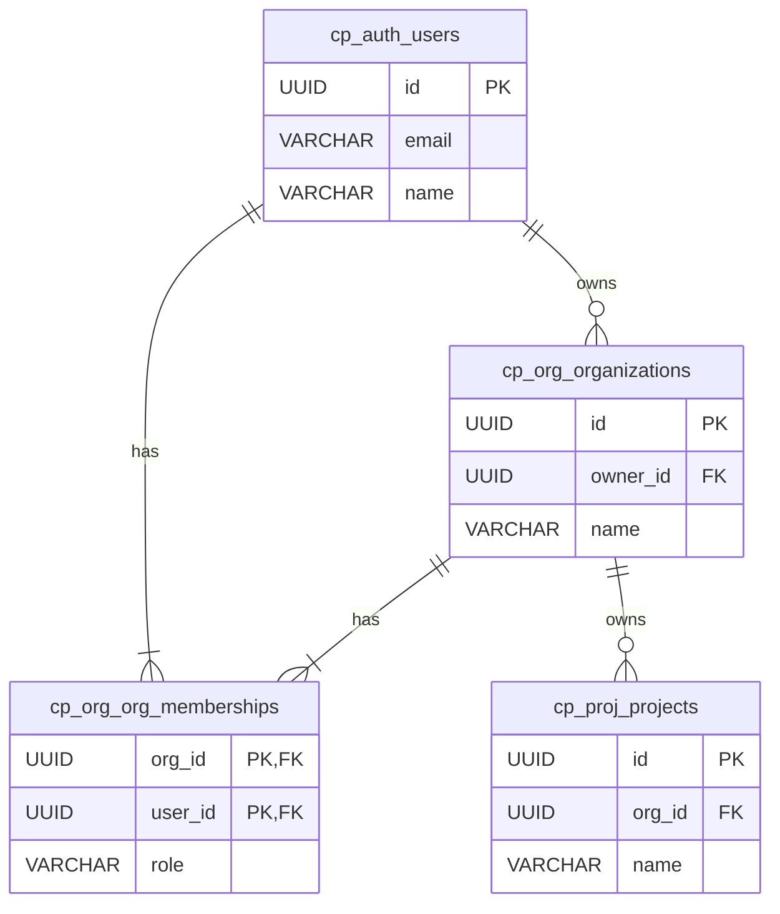

# MagFlock Enterprise Database Schema Specification (Single Source of Truth)

**Version:** 1.0  
**Status:** Authoritative  
**Audience:** Engineering, SRE, Security, Data, Compliance

---

## 0. Overview
This specification defines the complete, enterprise-grade database architecture for MagFlock. It spans the **Control Plane** (multi-tenant metadata, identity, governance, usage, networking, operations) and the **Data Plane** (portable per-project metadata). All definitions herein are normative.

**Key goals**
- Multi-tenancy with strong isolation
- Fine-grained RBAC and auditability
- API/contract exposure, secrets, and rotation
- Extensions/marketplace governance
- Realtime channels and auth bindings
- Usage, quota, billing, and invoices
- Network perimeter (allowlists, mTLS, device attestation)
- Backups/PITR and observability/SLOs
- Compliance: data residency, legal holds, immutable audit, anonymization
- Portability: mg_sys schema travels with each project database

**Conventions**
- **UUID** for primary keys; **TIMESTAMPTZ** for times
- **Snake_case** column names; singular table names where appropriate
- Soft deletes via `deleted_at` where needed (never re-use IDs)
- JSONB for flexible configuration; GIN indexes where queried
- All FKs specify `ON DELETE` behavior explicitly

---

## 1. Physical Layout
- **Control Plane database:** `magui_app` with bounded-context schemas:
  - `cp_auth`, `cp_org`, `cp_proj`, `cp_audit` (core)
  - `cp_rbac`, `cp_api`, `cp_secrets`, `cp_ext`, `cp_rt`, `cp_usage`, `cp_net`, `cp_bkp`, `cp_obs` (enterprise)
- **Per-project Data Plane schema:** `mg_sys` inside every project database

---

## 2. Core Control Plane Schemas (Authoritative)

### 2.1 `cp_auth` — Authentication & Identity
```sql
CREATE SCHEMA IF NOT EXISTS cp_auth;

CREATE TABLE cp_auth.identities (
  id UUID PRIMARY KEY DEFAULT gen_random_uuid(),
  type VARCHAR(40) NOT NULL CHECK (type IN ('user','service_account','agent')),
  created_at TIMESTAMPTZ NOT NULL DEFAULT now()
);

CREATE TABLE cp_auth.users (
  id UUID PRIMARY KEY DEFAULT gen_random_uuid(),
  identity_id UUID UNIQUE REFERENCES cp_auth.identities(id) ON DELETE CASCADE,
  email VARCHAR(255) UNIQUE NOT NULL,
  name VARCHAR(255) NOT NULL,
  status VARCHAR(50) NOT NULL DEFAULT 'pending',
  locale VARCHAR(16),
  timezone VARCHAR(64),
  two_factor_secret TEXT,
  two_factor_recovery_codes TEXT,
  created_at TIMESTAMPTZ NOT NULL DEFAULT now(),
  updated_at TIMESTAMPTZ NOT NULL DEFAULT now(),
  deleted_at TIMESTAMPTZ
);
CREATE INDEX IF NOT EXISTS idx_users_deleted_at ON cp_auth.users(deleted_at);

CREATE TABLE cp_auth.mfa_events (
  id UUID PRIMARY KEY DEFAULT gen_random_uuid(),
  identity_id UUID NOT NULL REFERENCES cp_auth.identities(id) ON DELETE CASCADE,
  event VARCHAR(64) NOT NULL, -- enrolled, challenge, success, failure
  context JSONB,
  created_at TIMESTAMPTZ NOT NULL DEFAULT now()
);

CREATE TABLE cp_auth.sessions (
  id UUID PRIMARY KEY DEFAULT gen_random_uuid(),
  identity_id UUID NOT NULL REFERENCES cp_auth.identities(id) ON DELETE CASCADE,
  user_agent TEXT,
  ip_address INET,
  created_at TIMESTAMPTZ NOT NULL DEFAULT now(),
  expires_at TIMESTAMPTZ NOT NULL
);
```

---

### 2.2 `cp_org` — Organizations & Tenancy
```sql
CREATE SCHEMA IF NOT EXISTS cp_org;

CREATE TABLE cp_org.organizations (
  id UUID PRIMARY KEY DEFAULT gen_random_uuid(),
  name VARCHAR(255) NOT NULL,
  owner_id UUID NOT NULL REFERENCES cp_auth.users(id) ON DELETE RESTRICT,
  status VARCHAR(50) NOT NULL DEFAULT 'active',
  region VARCHAR(64),
  data_residency_policy JSONB,
  compliance_posture JSONB,
  billing_tier VARCHAR(40) DEFAULT 'free',
  policy_bundle_id UUID,
  config JSONB,
  created_at TIMESTAMPTZ NOT NULL DEFAULT now(),
  updated_at TIMESTAMPTZ NOT NULL DEFAULT now(),
  UNIQUE(name)
);
CREATE INDEX IF NOT EXISTS idx_org_config ON cp_org.organizations USING GIN(config);

CREATE TABLE cp_org.org_memberships (
  org_id UUID NOT NULL REFERENCES cp_org.organizations(id) ON DELETE CASCADE,
  user_id UUID NOT NULL REFERENCES cp_auth.users(id) ON DELETE CASCADE,
  role VARCHAR(50) NOT NULL, -- legacy/simple role; full RBAC in cp_rbac
  created_at TIMESTAMPTZ NOT NULL DEFAULT now(),
  PRIMARY KEY (org_id, user_id)
);
```

---

### 2.3 `cp_proj` — Projects & Environments
```sql
CREATE SCHEMA IF NOT EXISTS cp_proj;

CREATE TABLE cp_proj.projects (
  id UUID PRIMARY KEY DEFAULT gen_random_uuid(),
  org_id UUID NOT NULL REFERENCES cp_org.organizations(id) ON DELETE CASCADE,
  name VARCHAR(255) NOT NULL,
  status VARCHAR(50) NOT NULL DEFAULT 'active',
  environment VARCHAR(24) NOT NULL DEFAULT 'prod' CHECK (environment IN ('dev','staging','prod')),
  provisioning_state VARCHAR(24) NOT NULL DEFAULT 'ready' CHECK (provisioning_state IN ('creating','ready','failed')),
  region_binding VARCHAR(64),
  anonymized_clone_of UUID,
  created_at TIMESTAMPTZ NOT NULL DEFAULT now(),
  updated_at TIMESTAMPTZ NOT NULL DEFAULT now(),
  UNIQUE (org_id, name)
);
CREATE INDEX IF NOT EXISTS idx_projects_org_id ON cp_proj.projects(org_id);
```

---

### 2.4 `cp_audit` — Immutable Audit Ledger
```sql
CREATE SCHEMA IF NOT EXISTS cp_audit;

CREATE TABLE cp_audit.audit_log (
  id UUID PRIMARY KEY DEFAULT gen_random_uuid(),
  org_id UUID,
  project_id UUID,
  user_id UUID,
  action VARCHAR(100) NOT NULL,
  payload JSONB,
  ip_address INET,
  immutable BOOLEAN NOT NULL DEFAULT true,
  legal_hold_id UUID,
  created_at TIMESTAMPTZ NOT NULL DEFAULT now()
);
CREATE INDEX IF NOT EXISTS idx_audit_org ON cp_audit.audit_log(org_id);
CREATE INDEX IF NOT EXISTS idx_audit_project ON cp_audit.audit_log(project_id);
CREATE INDEX IF NOT EXISTS idx_audit_user ON cp_audit.audit_log(user_id);
CREATE INDEX IF NOT EXISTS idx_audit_action ON cp_audit.audit_log(action);
CREATE INDEX IF NOT EXISTS idx_audit_created ON cp_audit.audit_log(created_at DESC);
CREATE INDEX IF NOT EXISTS idx_audit_payload ON cp_audit.audit_log USING GIN(payload);
```

---

## 3. Enterprise Control Plane Schemas (Authoritative)

### 3.1 `cp_rbac` — Role-Based Access Control
```sql
CREATE SCHEMA IF NOT EXISTS cp_rbac;

CREATE TABLE cp_rbac.roles (
  id UUID PRIMARY KEY DEFAULT gen_random_uuid(),
  name VARCHAR(120) UNIQUE NOT NULL,
  scope VARCHAR(24) NOT NULL CHECK (scope IN ('organization','project')),
  description TEXT
);

CREATE TABLE cp_rbac.capabilities (
  id UUID PRIMARY KEY DEFAULT gen_random_uuid(),
  name VARCHAR(160) UNIQUE NOT NULL,
  description TEXT
);

CREATE TABLE cp_rbac.role_capabilities (
  role_id UUID NOT NULL REFERENCES cp_rbac.roles(id) ON DELETE CASCADE,
  capability_id UUID NOT NULL REFERENCES cp_rbac.capabilities(id) ON DELETE CASCADE,
  PRIMARY KEY (role_id, capability_id)
);

CREATE TABLE cp_rbac.assignments (
  id UUID PRIMARY KEY DEFAULT gen_random_uuid(),
  identity_id UUID NOT NULL REFERENCES cp_auth.identities(id) ON DELETE CASCADE,
  role_id UUID NOT NULL REFERENCES cp_rbac.roles(id) ON DELETE CASCADE,
  resource_id UUID NOT NULL,   -- org or project id
  resource_type VARCHAR(24) NOT NULL CHECK (resource_type IN ('organization','project')),
  created_at TIMESTAMPTZ NOT NULL DEFAULT now()
);

CREATE TABLE cp_rbac.delegations (
  id UUID PRIMARY KEY DEFAULT gen_random_uuid(),
  assigner_id UUID NOT NULL REFERENCES cp_auth.identities(id) ON DELETE CASCADE,
  delegatee_id UUID NOT NULL REFERENCES cp_auth.identities(id) ON DELETE CASCADE,
  role_id UUID NOT NULL REFERENCES cp_rbac.roles(id) ON DELETE CASCADE,
  resource_id UUID NOT NULL,
  resource_type VARCHAR(24) NOT NULL CHECK (resource_type IN ('organization','project')),
  approval_status VARCHAR(24) NOT NULL DEFAULT 'pending' CHECK (approval_status IN ('pending','approved','rejected')),
  expires_at TIMESTAMPTZ,
  created_at TIMESTAMPTZ NOT NULL DEFAULT now()
);

CREATE TABLE cp_rbac.breakglass_events (
  id UUID PRIMARY KEY DEFAULT gen_random_uuid(),
  identity_id UUID NOT NULL REFERENCES cp_auth.identities(id) ON DELETE CASCADE,
  role_id UUID NOT NULL REFERENCES cp_rbac.roles(id) ON DELETE SET NULL,
  resource_id UUID,
  resource_type VARCHAR(24),
  justification TEXT NOT NULL,
  activated_at TIMESTAMPTZ NOT NULL DEFAULT now()
);
```

---

### 3.2 `cp_secrets` & `cp_api` — Secrets, API Keys, Contracts & Usage Metering
```sql
CREATE SCHEMA IF NOT EXISTS cp_secrets;
CREATE SCHEMA IF NOT EXISTS cp_api;

-- Secrets & Keys
CREATE TABLE cp_secrets.secrets_registry (
  id UUID PRIMARY KEY DEFAULT gen_random_uuid(),
  name VARCHAR(255) NOT NULL,
  type VARCHAR(40) NOT NULL CHECK (type IN ('api_key','tls_cert','jwk','oauth_client')),
  owner_id UUID REFERENCES cp_auth.identities(id) ON DELETE SET NULL,
  ttl_seconds INTEGER,
  rotation_policy JSONB,
  approved_egress JSONB,
  created_at TIMESTAMPTZ NOT NULL DEFAULT now(),
  updated_at TIMESTAMPTZ NOT NULL DEFAULT now()
);

CREATE TABLE cp_secrets.api_keys (
  id UUID PRIMARY KEY DEFAULT gen_random_uuid(),
  project_id UUID NOT NULL REFERENCES cp_proj.projects(id) ON DELETE CASCADE,
  identity_id UUID REFERENCES cp_auth.identities(id) ON DELETE SET NULL,
  key_prefix VARCHAR(16) UNIQUE NOT NULL,
  hashed_token TEXT NOT NULL,
  scopes JSONB NOT NULL,
  status VARCHAR(24) NOT NULL DEFAULT 'active' CHECK (status IN ('active','revoked')),
  expires_at TIMESTAMPTZ,
  last_used_at TIMESTAMPTZ,
  created_at TIMESTAMPTZ NOT NULL DEFAULT now()
);
CREATE INDEX IF NOT EXISTS idx_api_keys_scopes ON cp_secrets.api_keys USING GIN(scopes);

CREATE TABLE cp_secrets.rotation_jobs (
  id UUID PRIMARY KEY DEFAULT gen_random_uuid(),
  secret_id UUID NOT NULL REFERENCES cp_secrets.secrets_registry(id) ON DELETE CASCADE,
  status VARCHAR(24) NOT NULL DEFAULT 'scheduled' CHECK (status IN ('scheduled','running','completed','failed')),
  next_rotation_at TIMESTAMPTZ,
  created_at TIMESTAMPTZ NOT NULL DEFAULT now()
);

-- Data Contracts / Exposures
CREATE TABLE cp_api.exposures (
  id UUID PRIMARY KEY DEFAULT gen_random_uuid(),
  project_id UUID NOT NULL REFERENCES cp_proj.projects(id) ON DELETE CASCADE,
  name VARCHAR(255) NOT NULL,
  type VARCHAR(24) NOT NULL CHECK (type IN ('rest','graphql','realtime')),
  version VARCHAR(32) NOT NULL,
  status VARCHAR(24) NOT NULL DEFAULT 'draft' CHECK (status IN ('draft','published','deprecated')),
  config JSONB,
  approval_status VARCHAR(24) NOT NULL DEFAULT 'pending_review' CHECK (approval_status IN ('pending_review','approved','rejected')),
  created_at TIMESTAMPTZ NOT NULL DEFAULT now(),
  UNIQUE (project_id, name, version)
);
CREATE INDEX IF NOT EXISTS idx_exposures_config ON cp_api.exposures USING GIN(config);

CREATE TABLE cp_api.rate_plans (
  id UUID PRIMARY KEY DEFAULT gen_random_uuid(),
  exposure_id UUID NOT NULL REFERENCES cp_api.exposures(id) ON DELETE CASCADE,
  name VARCHAR(120) NOT NULL,
  quota_tier VARCHAR(24) NOT NULL CHECK (quota_tier IN ('free','pro','enterprise')),
  rate_limit INTEGER NOT NULL,
  burst INTEGER NOT NULL,
  UNIQUE(exposure_id, name)
);

-- Usage metering (can be hypertable if using TimescaleDB)
CREATE TABLE cp_api.usage_hyper (
  time TIMESTAMPTZ NOT NULL,
  api_key_id UUID REFERENCES cp_secrets.api_keys(id) ON DELETE SET NULL,
  project_id UUID NOT NULL REFERENCES cp_proj.projects(id) ON DELETE CASCADE,
  org_id UUID REFERENCES cp_org.organizations(id) ON DELETE SET NULL,
  metric_type VARCHAR(40) NOT NULL, -- api_call, storage_gb, compute_seconds
  quantity BIGINT NOT NULL,
  PRIMARY KEY (time, api_key_id, metric_type)
);

CREATE TABLE cp_api.change_history (
  id UUID PRIMARY KEY DEFAULT gen_random_uuid(),
  exposure_id UUID NOT NULL REFERENCES cp_api.exposures(id) ON DELETE CASCADE,
  changed_by UUID REFERENCES cp_auth.identities(id) ON DELETE SET NULL,
  diff JSONB,
  timestamp TIMESTAMPTZ NOT NULL DEFAULT now()
);
```

---

### 3.3 `cp_ext` — Extension & Marketplace Ecosystem
```sql
CREATE SCHEMA IF NOT EXISTS cp_ext;

CREATE TABLE cp_ext.registry (
  id UUID PRIMARY KEY DEFAULT gen_random_uuid(),
  name VARCHAR(255) UNIQUE NOT NULL, -- e.g. acme.payments
  publisher_id UUID REFERENCES cp_auth.identities(id) ON DELETE SET NULL,
  latest_version VARCHAR(32),
  manifest JSONB NOT NULL,
  created_at TIMESTAMPTZ NOT NULL DEFAULT now()
);

CREATE TABLE cp_ext.installations (
  id UUID PRIMARY KEY DEFAULT gen_random_uuid(),
  extension_id UUID NOT NULL REFERENCES cp_ext.registry(id) ON DELETE CASCADE,
  project_id UUID NOT NULL REFERENCES cp_proj.projects(id) ON DELETE CASCADE,
  version VARCHAR(32) NOT NULL,
  status VARCHAR(24) NOT NULL CHECK (status IN ('installing','enabled','disabled','failed')),
  config_overrides JSONB,
  created_at TIMESTAMPTZ NOT NULL DEFAULT now(),
  UNIQUE(project_id, extension_id)
);

CREATE TABLE cp_ext.capability_grants (
  installation_id UUID NOT NULL REFERENCES cp_ext.installations(id) ON DELETE CASCADE,
  capability VARCHAR(160) NOT NULL,
  resource_scope VARCHAR(24) NOT NULL CHECK (resource_scope IN ('project','org','global')),
  PRIMARY KEY (installation_id, capability)
);

CREATE TABLE cp_ext.resource_quotas (
  installation_id UUID PRIMARY KEY REFERENCES cp_ext.installations(id) ON DELETE CASCADE,
  cpu_millis INTEGER,
  memory_mb INTEGER,
  db_connections INTEGER
);

CREATE TABLE cp_ext.health_checks (
  installation_id UUID PRIMARY KEY REFERENCES cp_ext.installations(id) ON DELETE CASCADE,
  last_check_at TIMESTAMPTZ,
  status VARCHAR(24) NOT NULL CHECK (status IN ('healthy','degraded','unhealthy')),
  message TEXT
);

CREATE TABLE cp_ext.sandbox_telemetry (
  id UUID PRIMARY KEY DEFAULT gen_random_uuid(),
  installation_id UUID NOT NULL REFERENCES cp_ext.installations(id) ON DELETE CASCADE,
  time TIMESTAMPTZ NOT NULL,
  cpu_usage DOUBLE PRECISION,
  memory_usage DOUBLE PRECISION,
  network_egress_bytes BIGINT
);

CREATE TABLE cp_ext.rollouts (
  id UUID PRIMARY KEY DEFAULT gen_random_uuid(),
  installation_id UUID NOT NULL REFERENCES cp_ext.installations(id) ON DELETE CASCADE,
  version VARCHAR(32) NOT NULL,
  current_ring VARCHAR(4) NOT NULL CHECK (current_ring IN ('R0','R1','R2','R3')),
  status VARCHAR(24) NOT NULL CHECK (status IN ('active','paused','failed')),
  created_at TIMESTAMPTZ NOT NULL DEFAULT now()
);

CREATE TABLE cp_ext.cve_findings (
  id UUID PRIMARY KEY DEFAULT gen_random_uuid(),
  installation_id UUID NOT NULL REFERENCES cp_ext.installations(id) ON DELETE CASCADE,
  cve_id VARCHAR(40) NOT NULL,
  severity VARCHAR(16) NOT NULL,
  found_at TIMESTAMPTZ NOT NULL DEFAULT now()
);

CREATE TABLE cp_ext.waivers (
  id UUID PRIMARY KEY DEFAULT gen_random_uuid(),
  cve_finding_id UUID NOT NULL REFERENCES cp_ext.cve_findings(id) ON DELETE CASCADE,
  justification TEXT NOT NULL,
  expires_at TIMESTAMPTZ
);
```

---

### 3.4 `cp_rt` — Realtime Messaging
```sql
CREATE SCHEMA IF NOT EXISTS cp_rt;

CREATE TABLE cp_rt.channels (
  id UUID PRIMARY KEY DEFAULT gen_random_uuid(),
  project_id UUID NOT NULL REFERENCES cp_proj.projects(id) ON DELETE CASCADE,
  name VARCHAR(255) NOT NULL,
  type VARCHAR(24) NOT NULL CHECK (type IN ('pubsub','presence','stream')),
  created_at TIMESTAMPTZ NOT NULL DEFAULT now(),
  UNIQUE(project_id, name)
);

CREATE TABLE cp_rt.presence_policies (
  channel_id UUID PRIMARY KEY REFERENCES cp_rt.channels(id) ON DELETE CASCADE,
  visibility_scope VARCHAR(24) NOT NULL CHECK (visibility_scope IN ('team','org','custom')),
  policy JSONB
);

CREATE TABLE cp_rt.auth_bindings (
  id UUID PRIMARY KEY DEFAULT gen_random_uuid(),
  channel_id UUID NOT NULL REFERENCES cp_rt.channels(id) ON DELETE CASCADE,
  identity_id UUID REFERENCES cp_auth.identities(id) ON DELETE SET NULL,
  permissions JSONB NOT NULL -- publish/subscribe/manage
);

CREATE TABLE cp_rt.replay_configs (
  channel_id UUID PRIMARY KEY REFERENCES cp_rt.channels(id) ON DELETE CASCADE,
  replay_window_seconds INTEGER NOT NULL,
  storage_class VARCHAR(16) NOT NULL CHECK (storage_class IN ('hot','cold'))
);
```

---

### 3.5 `cp_usage` — Usage, Quotas & Billing
```sql
CREATE SCHEMA IF NOT EXISTS cp_usage;

CREATE TABLE cp_usage.quota_definitions (
  id UUID PRIMARY KEY DEFAULT gen_random_uuid(),
  name VARCHAR(120) NOT NULL,
  metric_type VARCHAR(40) NOT NULL,
  limit BIGINT NOT NULL,
  period VARCHAR(24) NOT NULL CHECK (period IN ('hourly','daily','monthly')),
  UNIQUE(name, metric_type, period)
);

CREATE TABLE cp_usage.entitlements (
  id UUID PRIMARY KEY DEFAULT gen_random_uuid(),
  org_id UUID NOT NULL REFERENCES cp_org.organizations(id) ON DELETE CASCADE,
  quota_id UUID NOT NULL REFERENCES cp_usage.quota_definitions(id) ON DELETE RESTRICT,
  start_at TIMESTAMPTZ NOT NULL,
  end_at TIMESTAMPTZ,
  UNIQUE(org_id, quota_id, start_at)
);

CREATE TABLE cp_usage.usage_aggregates (
  org_id UUID NOT NULL REFERENCES cp_org.organizations(id) ON DELETE CASCADE,
  metric_type VARCHAR(40) NOT NULL,
  period_start TIMESTAMPTZ NOT NULL,
  total_used BIGINT NOT NULL,
  PRIMARY KEY (org_id, metric_type, period_start)
);

CREATE TABLE cp_usage.invoices (
  id UUID PRIMARY KEY DEFAULT gen_random_uuid(),
  org_id UUID NOT NULL REFERENCES cp_org.organizations(id) ON DELETE CASCADE,
  amount_cents BIGINT NOT NULL,
  currency VARCHAR(8) NOT NULL DEFAULT 'USD',
  billing_period_start TIMESTAMPTZ NOT NULL,
  billing_period_end TIMESTAMPTZ NOT NULL,
  status VARCHAR(24) NOT NULL CHECK (status IN ('draft','issued','paid','void')),
  created_at TIMESTAMPTZ NOT NULL DEFAULT now()
);

CREATE TABLE cp_usage.overage_events (
  id UUID PRIMARY KEY DEFAULT gen_random_uuid(),
  entitlement_id UUID NOT NULL REFERENCES cp_usage.entitlements(id) ON DELETE CASCADE,
  excess_amount BIGINT NOT NULL,
  action_taken VARCHAR(24) NOT NULL CHECK (action_taken IN ('alert','throttle','suspend')),
  occurred_at TIMESTAMPTZ NOT NULL DEFAULT now()
);
```

---

### 3.6 `cp_net` — Networking & Zero Trust
```sql
CREATE SCHEMA IF NOT EXISTS cp_net;

CREATE TABLE cp_net.allowlists (
  id UUID PRIMARY KEY DEFAULT gen_random_uuid(),
  scope_id UUID NOT NULL, -- org or project id
  scope_type VARCHAR(24) NOT NULL CHECK (scope_type IN ('org','project')),
  cidr INET NOT NULL,
  description TEXT
);

CREATE TABLE cp_net.mtls_policies (
  id UUID PRIMARY KEY DEFAULT gen_random_uuid(),
  project_id UUID NOT NULL REFERENCES cp_proj.projects(id) ON DELETE CASCADE,
  ca_bundle TEXT NOT NULL,
  enforce_client_cert BOOLEAN NOT NULL DEFAULT true
);

CREATE TABLE cp_net.device_attestations (
  id UUID PRIMARY KEY DEFAULT gen_random_uuid(),
  device_id VARCHAR(120) UNIQUE NOT NULL,
  project_id UUID NOT NULL REFERENCES cp_proj.projects(id) ON DELETE CASCADE,
  public_key TEXT NOT NULL,
  last_seen TIMESTAMPTZ
);

CREATE TABLE cp_net.mqtt_credentials (
  device_id VARCHAR(120) PRIMARY KEY REFERENCES cp_net.device_attestations(device_id) ON DELETE CASCADE,
  username VARCHAR(255) NOT NULL,
  hashed_password TEXT NOT NULL
);
```

---

### 3.7 `cp_bkp` — Backups & Recovery
```sql
CREATE SCHEMA IF NOT EXISTS cp_bkp;

CREATE TABLE cp_bkp.backup_plans (
  id UUID PRIMARY KEY DEFAULT gen_random_uuid(),
  project_id UUID NOT NULL REFERENCES cp_proj.projects(id) ON DELETE CASCADE,
  frequency_cron VARCHAR(120) NOT NULL,
  retention_days INTEGER NOT NULL,
  type VARCHAR(24) NOT NULL CHECK (type IN ('full','logical','snapshot')),
  created_at TIMESTAMPTZ NOT NULL DEFAULT now()
);

CREATE TABLE cp_bkp.backup_jobs (
  id UUID PRIMARY KEY DEFAULT gen_random_uuid(),
  plan_id UUID NOT NULL REFERENCES cp_bkp.backup_plans(id) ON DELETE CASCADE,
  status VARCHAR(24) NOT NULL CHECK (status IN ('pending','running','completed','failed')),
  artifact_uri VARCHAR(2048),
  started_at TIMESTAMPTZ NOT NULL DEFAULT now(),
  completed_at TIMESTAMPTZ,
  failure_reason TEXT
);

CREATE TABLE cp_bkp.pitr_windows (
  project_id UUID PRIMARY KEY REFERENCES cp_proj.projects(id) ON DELETE CASCADE,
  earliest_time TIMESTAMPTZ NOT NULL,
  latest_time TIMESTAMPTZ NOT NULL
);

CREATE TABLE cp_bkp.retention_policies (
  id UUID PRIMARY KEY DEFAULT gen_random_uuid(),
  name VARCHAR(120) NOT NULL,
  data_class VARCHAR(24) NOT NULL CHECK (data_class IN ('backup','audit','telemetry')),
  retention_days INTEGER NOT NULL
);
```

---

### 3.8 `cp_obs` — Observability, SLOs & Incidents
```sql
CREATE SCHEMA IF NOT EXISTS cp_obs;

CREATE TABLE cp_obs.telemetry_configs (
  id UUID PRIMARY KEY DEFAULT gen_random_uuid(),
  project_id UUID NOT NULL REFERENCES cp_proj.projects(id) ON DELETE CASCADE,
  name VARCHAR(255) NOT NULL,
  config JSONB NOT NULL, -- table, columns, aggregations, schedule
  created_at TIMESTAMPTZ NOT NULL DEFAULT now()
);

CREATE TABLE cp_obs.slo_definitions (
  id UUID PRIMARY KEY DEFAULT gen_random_uuid(),
  project_id UUID NOT NULL REFERENCES cp_proj.projects(id) ON DELETE CASCADE,
  name VARCHAR(255) NOT NULL,
  target_percent DOUBLE PRECISION NOT NULL,
  window_days INTEGER NOT NULL
);

CREATE TABLE cp_obs.error_budgets (
  slo_id UUID NOT NULL REFERENCES cp_obs.slo_definitions(id) ON DELETE CASCADE,
  period_start TIMESTAMPTZ NOT NULL,
  total_budget DOUBLE PRECISION NOT NULL,
  burned DOUBLE PRECISION NOT NULL DEFAULT 0,
  PRIMARY KEY (slo_id, period_start)
);

CREATE TABLE cp_obs.alert_policies (
  id UUID PRIMARY KEY DEFAULT gen_random_uuid(),
  project_id UUID NOT NULL REFERENCES cp_proj.projects(id) ON DELETE CASCADE,
  metric VARCHAR(120) NOT NULL,
  threshold DOUBLE PRECISION NOT NULL,
  severity VARCHAR(16) NOT NULL CHECK (severity IN ('warning','critical'))
);

CREATE TABLE cp_obs.incident_links (
  error_budget_id UUID NOT NULL,
  incident_id VARCHAR(120) NOT NULL,
  PRIMARY KEY (error_budget_id, incident_id)
);
```

---

## 4. Data Plane Schema (`mg_sys`) — Portable Project Metadata
```sql
CREATE SCHEMA IF NOT EXISTS mg_sys;

CREATE TABLE mg_sys.project_info (
  org_id UUID NOT NULL,
  project_id UUID PRIMARY KEY,
  environment VARCHAR(24) NOT NULL,
  region VARCHAR(64),
  engine_type VARCHAR(24) NOT NULL, -- postgres, mysql, etc.
  adapter_version VARCHAR(24) NOT NULL,
  created_at TIMESTAMPTZ NOT NULL DEFAULT now()
);

CREATE TABLE mg_sys.exposures_map (
  exposure_id UUID PRIMARY KEY,
  object_type VARCHAR(50) NOT NULL,
  object_name VARCHAR(255) NOT NULL,
  version VARCHAR(50) NOT NULL,
  config JSONB,
  created_at TIMESTAMPTZ NOT NULL DEFAULT now()
);

CREATE TABLE mg_sys.migrations_log (
  id SERIAL PRIMARY KEY,
  migration_name VARCHAR(255) NOT NULL,
  batch INTEGER NOT NULL,
  applied_at TIMESTAMPTZ NOT NULL DEFAULT now()
);

CREATE TABLE mg_sys.security_policies (
  id UUID PRIMARY KEY DEFAULT gen_random_uuid(),
  name VARCHAR(255) NOT NULL,
  target_object VARCHAR(255) NOT NULL,
  policy_type VARCHAR(24) NOT NULL CHECK (policy_type IN ('rls','masking')),
  policy_definition TEXT NOT NULL,
  version INTEGER NOT NULL DEFAULT 1,
  created_at TIMESTAMPTZ NOT NULL DEFAULT now()
);

CREATE TABLE mg_sys.backup_markers (
  id UUID PRIMARY KEY DEFAULT gen_random_uuid(),
  job_id UUID,
  marker_time TIMESTAMPTZ NOT NULL,
  description TEXT
);

CREATE TABLE mg_sys.extension_state (
  extension_name VARCHAR(255) PRIMARY KEY,
  version VARCHAR(32) NOT NULL,
  hook_registrations JSONB
);

CREATE TABLE mg_sys.staging_ledger (
  id UUID PRIMARY KEY DEFAULT gen_random_uuid(),
  source VARCHAR(255) NOT NULL,
  staging_table VARCHAR(255) NOT NULL,
  quarantine_reason TEXT,
  promoted_at TIMESTAMPTZ
);

CREATE TABLE mg_sys.anonymization_audit (
  id UUID PRIMARY KEY DEFAULT gen_random_uuid(),
  job_id VARCHAR(120) NOT NULL,
  source_table VARCHAR(255) NOT NULL,
  rules_applied JSONB NOT NULL,
  exported_at TIMESTAMPTZ NOT NULL DEFAULT now()
);

-- Telemetry builder outputs (pattern; create per-config tables as hypertables if available)
-- CREATE TABLE mg_sys.telemetry_data_<name> (time TIMESTAMPTZ, metric_value DOUBLE PRECISION, dimensions JSONB, PRIMARY KEY(time));
```

---

## 5. Cross-Cutting Governance & Compliance Models
```sql
-- Security Development Lifecycle (SDL)
CREATE SCHEMA IF NOT EXISTS cp_sec;

CREATE TABLE cp_sec.threat_models (
  id UUID PRIMARY KEY DEFAULT gen_random_uuid(),
  scope_type VARCHAR(24) NOT NULL CHECK (scope_type IN ('org','project','platform')),
  scope_id UUID,
  model JSONB NOT NULL,
  created_at TIMESTAMPTZ NOT NULL DEFAULT now()
);

CREATE TABLE cp_sec.pen_test_results (
  id UUID PRIMARY KEY DEFAULT gen_random_uuid(),
  vendor VARCHAR(255) NOT NULL,
  report_uri VARCHAR(2048),
  findings JSONB,
  tested_at TIMESTAMPTZ NOT NULL
);

CREATE TABLE cp_sec.vulnerability_remediations (
  id UUID PRIMARY KEY DEFAULT gen_random_uuid(),
  cve_id VARCHAR(40) NOT NULL,
  status VARCHAR(24) NOT NULL CHECK (status IN ('identified','in_progress','remediated','waived')),
  owner VARCHAR(255),
  due_at TIMESTAMPTZ
);

-- Legal Holds & Data Lifecycle
CREATE TABLE cp_sec.legal_holds (
  id UUID PRIMARY KEY DEFAULT gen_random_uuid(),
  name VARCHAR(255) NOT NULL,
  reason TEXT,
  created_at TIMESTAMPTZ NOT NULL DEFAULT now()
);

CREATE TABLE cp_sec.purge_logs (
  id UUID PRIMARY KEY DEFAULT gen_random_uuid(),
  scope_type VARCHAR(24) NOT NULL CHECK (scope_type IN ('org','project','table','rowset')),
  scope_id UUID,
  rules JSONB NOT NULL,
  performed_at TIMESTAMPTZ NOT NULL DEFAULT now()
);

CREATE TABLE cp_sec.retention_enforcement_jobs (
  id UUID PRIMARY KEY DEFAULT gen_random_uuid(),
  started_at TIMESTAMPTZ NOT NULL DEFAULT now(),
  completed_at TIMESTAMPTZ,
  outcome JSONB
);

CREATE TABLE cp_sec.anonymization_schedules (
  id UUID PRIMARY KEY DEFAULT gen_random_uuid(),
  scope_type VARCHAR(24) NOT NULL CHECK (scope_type IN ('org','project')),
  schedule_cron VARCHAR(120) NOT NULL,
  rules JSONB NOT NULL
);

-- Reliability & SLA
CREATE TABLE cp_sec.downtime_credits (
  id UUID PRIMARY KEY DEFAULT gen_random_uuid(),
  org_id UUID NOT NULL REFERENCES cp_org.organizations(id) ON DELETE CASCADE,
  incident_id VARCHAR(120) NOT NULL,
  credit_cents BIGINT NOT NULL,
  issued_at TIMESTAMPTZ NOT NULL DEFAULT now()
);

CREATE TABLE cp_sec.sla_attestations (
  id UUID PRIMARY KEY DEFAULT gen_random_uuid(),
  period_start TIMESTAMPTZ NOT NULL,
  period_end TIMESTAMPTZ NOT NULL,
  statement JSONB NOT NULL
);

CREATE TABLE cp_sec.incident_root_causes (
  id UUID PRIMARY KEY DEFAULT gen_random_uuid(),
  incident_id VARCHAR(120) NOT NULL,
  cause TEXT NOT NULL,
  corrective_actions JSONB,
  recorded_at TIMESTAMPTZ NOT NULL DEFAULT now()
);
```

---

## 6. Referential Integrity & Access Patterns
- All foreign keys defined with explicit `ON DELETE` policies
- GIN indexes on JSONB fields that participate in queries (`config`, `scopes`, `payload`, etc.)
- Partitioning candidates: `cp_audit.audit_log` by `created_at`, `cp_api.usage_hyper` by time
- Common query indexes included; extend per workload profiling

---

## 7. Security & Privacy Controls
- **RBAC resolution:** capability graph resolved from `assignments` → `roles` → `role_capabilities`
- **Emergency access:** `breakglass_events` mandatory recording & alerting
- **Secrets:** never store raw tokens; store **hashes** + prefixes
- **mTLS & allowlists:** enforced via `cp_net`
- **Audit immutability:** `immutable=true`; legal hold links prevent purge
- **Residency:** `organizations.region` and data residency policy enforced in provisioning
- **Anonymization:** `mg_sys.anonymization_audit` and schedules in `cp_sec`

---

## 8. Migration & Versioning Strategy
- All DDL changes delivered via idempotent migrations and recorded in `mg_sys.migrations_log`
- Semantic versions on exposures and extensions; contract change history in `cp_api.change_history`
- Backward-compatible changes by default; deprecations require published window & feature flags

---

## 9. ERD (Core)


---

## 10. Non-Functional Requirements Checklist
- [x] Multi-tenant isolation
- [x] Fine-grained RBAC & delegation
- [x] Immutable audit + legal holds
- [x] API contracts + metering
- [x] Secrets & rotation
- [x] Extensions governance & sandbox telemetry
- [x] Realtime channels with replay configs
- [x] Usage, quotas, billing & overage actions
- [x] Network perimeter (allowlists, mTLS, device auth)
- [x] Backups, PITR, retention
- [x] Observability, SLOs, error budgets
- [x] Data plane portability (mg_sys)

---

## 11. Implementation Notes
- Prefer **TimescaleDB** for time-series tables where available (`usage_hyper`, telemetry outputs)
- Use **Row Level Security** in project databases; manage policies via `mg_sys.security_policies`
- Rotate secrets via `cp_secrets.rotation_jobs` and propagate via control-plane services
- Ensure **idempotent** and **retry-safe** provisioning flows—`cp_proj.projects.provisioning_state` is the source of truth
- Maintain **contract diffs** in `cp_api.change_history` to trace exposure evolution

---

## 12. Appendix: Default Capabilities (seed data sketch)
- `project:create`, `project:delete`, `apikey:manage`, `backup:restore`, `exposure:publish`, `quota:assign`, `invoice:view`, `network:policy.manage`, `rbac:delegate`, `extension:install`, `realtime:channel.manage`

*End of specification.*

